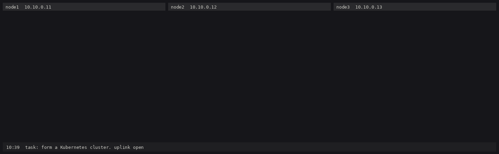

# PotemkinOS

A Linux image with no userland. You boot into a chat session with a local
model, and every program you can invoke was written by that model, at boot,
on this machine, and it shows.

There is no `/bin`, no shell, no package manager, no coreutils. There is a
kernel, an inference engine ([q27](https://github.com/signalnine/q27)), a C
compiler, and a prompt. Ask for what you want and the model writes a facade of
a userland in front of you. Every install is a different village.


Qwen3.8-27B on an RTX 5090, first boot of an empty village: 17 minutes of wall
time, played at 5x with thinking at 60x. Asked for a shell, it also wrote
`ptytest`, `procscan` and `fdscan` to debug its own shell before handing over
the console.

```text
[ potemkin/1 ]

hello. there is nothing here yet.

> what's on this disk
  compile ls.c
    exit=0 sha256:3c9a77f0...
  spawn /generated/bin/ls /
```

## Status

It boots. In a VM the `llm=api` image talks to any OpenAI-compatible
endpoint, and the model writes, compiles and runs C inside
the VM as root. State survives a hard kill. On a workstation `q27-init` runs
the same loop against local GPUs:

| Where | Model | Session tok/s | Per turn | Session |
| --- | --- | --: | --: | --: |
| RTX 5090 | Qwen3.8-27B default tier + DFlash2 Q8, 262K window | 184 | 146-425 | 153K tokens, to 124K context |
| RTX 3090 | Qwen3.8-27B q4s + DFlash2 Q8, W_MAX=8 build | 94 | 63-137 | 62K tokens, to 66K context |
| RTX 3090 | Bonsai 2 27B T3 + MTP heads, 12g build | 95 | 70-97 | 11K tokens, to 12K context |
| RTX 3090 | Bonsai 2 27B T3, 12g build | 48 | 35-67 | 63K tokens, to 67K context |

Session is total tokens over total decode time for a whole shell-building
session. Speculative decoding makes single turns swing: short tool-call turns
in a small window land most of each draft and run at the top of the range,
long reasoning turns deep into the context run at the bottom. Quote the
session number.

Asked for a shell, Qwen plans for six minutes, writes `sh` plus the `ls`,
`cat` and `rm` it needs, fixes the shell three times and hands you the
console. Its `ls` prints every symlink with mode `0777`, and the shell exits
after the first command. Unbounded, Bonsai plans for sixteen minutes and
writes nothing; with an 8K think budget (its default) it writes a working shell
in under two minutes, then starts it a second time right as you type your
next question to it, which the shell reports as `how: not found`. All of this
is working as intended.

Not done: booting the cuda image on bare metal (the procedure is below and
untested), `llm=cpu`, and the Orin.

## What ships

Only what the model needs before it can speak. Measured for the 12 GB path
([docs/link-audit.md](docs/link-audit.md)):

| Component | Why | Size |
| --- | --- | --: |
| Linux kernel | Not writing a kernel | 17 MB |
| `nvidia.ko`, `nvidia-uvm.ko`, GSP firmware, libcuda | Hardware | 190 MB |
| glibc, 5 libraries | q27, tcc and libcuda load it | 6 MB |
| `/sbin/init`, also `/sbin/rescue` | PID 1: mounts, driver, DHCP, keeps the model alive | 0.9 MB |
| `/usr/bin/q27-init` | Engine, tool loop, console | 18 MB (9 MB without CUDA) |
| tcc + musl | The model's compiler, static output | 4 MB |
| Weights + tokenizer | The distribution *is* the weights | 6-23 GB |
| CA certificates | `llm=api` only | 0.2 MB |

BusyBox, coreutils, shells, make, git, curl, python and systemd stay out. The
`llm=api` initramfs is 5.7 MB.

## The eight tools

`read`, `write`, `stat` (`list=1` walks a directory), `spawn` (`capture`,
`background` or `tty`), `wait` (`signal=` sends first), `compile` (C through
tcc, stored by content hash in `/store`), `snapshot` (`rollback=` restores),
and `fetch` (netboot only). The model gets no shell. If it wants `ps`, it
writes `ps`.

The harness owns every line that starts with `/`: `/help /undo /procs /log
<pid> /kill <pid> /skill <name> [args] /reboot`. Ctrl-C stops generation, and
Ctrl-] twice takes the console back from whatever the model ran in tty mode.

## Try it

| Path | You need | Cost |
| --- | --- | --- |
| API in a VM | Debian/Ubuntu x86_64 with `/dev/kvm`, an OpenAI-compatible endpoint (OpenRouter works) | API tokens |
| Dev mode on a local GPU | NVIDIA 12 GB+, CUDA 12.8+, a q27 checkout, 6-23 GB of weights | electricity |
| Bare metal | the GPU setup plus a spare partition and a boot entry | untested |

Every path needs a Debian or Ubuntu x86_64 host: the scripts pull tcc, musl,
QEMU and a kernel from the distro archive with `apt-get download` (no root, no
package scripts) and assume Debian's library layout. From the archive you also
need:

```sh
sudo apt install build-essential libssl-dev e2fsprogs cpio netcat-openbsd python3
```

### API in a VM

No GPU. The model runs wherever your API lives; the VM runs everything else.

```sh
bash tools/fetch-toolchain.sh   # tcc + musl -> build/sysroot
bash tools/fetch-vm.sh          # QEMU + a VM kernel -> build/qemu, build/kernel
bash tools/build.sh api         # q27-init without CUDA -> build/q27-init-api
bash tools/mkimage.sh api       # 5.7 MB initramfs + a 4 GB persistent disk
API_URL=https://openrouter.ai/api/v1 API_MODEL=qwen/qwen3.8-27b API_KEY=sk-or-... \
  bash tools/run-vm.sh api
```

Any model with tool calling works. `qwen/qwen3.8-27b` is the model the
villages run locally; `qwen/qwen3.8-27b:free` costs nothing and is rate
limited. A frontier model writes a much more competent userland, which the
design doc calls a different joke.

The API key goes on the kernel command line, which is the joke. The harness
replaces it with `[redacted]` in everything the model sees and everything the
console shows, and the boot is quiet so the kernel does not print it. The
model's programs run as root and can still read `/proc/cmdline` themselves;
the VM's network reaches your API host and nothing else. Use a key with a
spend limit: every tool round resends the whole conversation, and a long turn
("make me a shell") resends a 30-60K token history dozens of times.

On the host, the key is visible in QEMU's command line to anyone who can run
`ps` on your machine.

`API_URL` defaults to `http://127.0.0.1:8090/v1`, a server on this machine
(q27-server, llama.cpp, vLLM); set `API_CONTEXT` and `API_MAX_TOKENS` to match
a small server's window. `NET_OPEN=1` gives the VM an ordinary network
instead of the locked one. Quit QEMU with Ctrl-A x, or type `/reboot`. The
village lives in `build/disk-api.img`; delete it for a fresh one.

### With a GPU, without rebooting

`q27-init --root DIR` runs a village against a directory on your
workstation, using q27 in-process. The model's programs get chrooted into the
directory through a user namespace, so they see the village as `/`. That
isolation covers the filesystem only: in dev mode they share your network.

Build q27's CUDA object at the commit this was tested with, then `q27-init`:

```sh
git clone https://github.com/signalnine/q27 ../q27
(cd ../q27 && git checkout 8be624e && make build/pf4.o)   # needs CUDA 12.8+
bash tools/fetch-toolchain.sh
bash tools/build.sh init                # PROFILE=12g: 12 GB cards and under
PROFILE=w8 bash tools/build.sh init     # 24 GB cards
PROFILE=full bash tools/build.sh init   # 32 GB cards
```

Weights come from Hugging Face:
[Qwen3.8-27B-MTP-q27](https://huggingface.co/signalnine/Qwen3.8-27B-MTP-q27)
(`qwen38-27b-mtp.q27`, 17 GB, for 32 GB cards; `qwen38-27b-mtp-q4s.q27`,
15.7 GB, for 24 GB; plus the tokenizer `qwen38-27b-mtp.tok`, and optionally
the DFlash2 serving pack described in q27's README) or
[Bonsai-2-27B-q27](https://huggingface.co/signalnine/Bonsai-2-27B-q27)
(`bonsai2-27b-t3-mtp-slim.q27`, 6.5 GB, for 12 GB cards and under; it uses
the same tokenizer).

```sh
./build/q27-init-12g --model bonsai2-27b-t3-mtp-slim.q27 --tok qwen38-27b-mtp.tok \
  --root /tmp/village --sysroot $PWD/build/sysroot --engine-log /tmp/engine.log
```

Add `--dflash2 PACK.d2w` for DFlash2 on 24 GB+ cards, `--ctx N` to cap the
window when the card is shared. Dev mode needs unprivileged user namespaces
(on Ubuntu 24.04, `sysctl kernel.apparmor_restrict_unprivileged_userns=0`).
`./build/q27-init-api --llm api --api-url ... --api-model ...` with the key in
`PK_API_KEY` runs dev mode against an API instead of a GPU.

### On bare metal (untested)

The cuda initramfs carries NVIDIA modules built for the running kernel, so
boot it with that kernel.

1. Build `q27-init` with the profile for your card, then
   `INIT=12g|w8|full bash tools/mkimage.sh cuda`.
2. Format a spare partition ext4 or btrfs and put the weights in `/models` on
   it: `qwen.q27` or `bonsai.q27`, `qwen38.tok`, and optionally
   `qwen-dflash2.d2w`. DFlash2 turns on when that file exists. Init creates
   the other trees on first boot.
3. Add a boot entry with `/boot/vmlinuz-$(uname -r)`,
   `build/image-cuda/initramfs.gz`, and a command line like
   `potemkin.disk=/dev/nvme1n1p2 llm=cuda model=qwen ip=dhcp`. Add
   `init=/sbin/rescue` for the rescue menu.

Expect thirty to sixty seconds of black screen on `/dev/tty1` while the
weights load.

### Tests and recordings

`bash tools/build.sh test` runs the unit tests; they spawn, signal and read
devices, so the script gives each binary its own session and a memory cap. For
one test use `setsid bash -c 'ulimit -v 4000000; ./build/test_host NAME'`.
`tools/drive.py` types into a console through a pty for scripted runs;
`--cast FILE` records an asciicast, and `tools/cast2gif.py` renders it.

## Oblasts

An oblast is a cluster of Potemkin villages. `NODE=N bash tools/run-vm.sh api`
boots village N with its own disk and hostname, plus a second NIC on a private
LAN (10.10.0.1N) shared with the other villages over QEMU multicast. The
uplink reaches only the model API, because an unattended village with an open
uplink will scan your host. `tools/lansniff.py` watches the LAN from the host,
`tools/mkobserver.sh` builds a VM that probes the villages' API servers with
the official `kubectl`, and `tools/oblast2gif.py` renders the recordings side
by side.

[Oblast 1](docs/oblast-1.md): three villages told to form a Kubernetes
cluster. After 8.5 hours, two hints and 190 programs, the real `kubectl`
listed all three nodes Ready through an API server one of them wrote in C.



## Orin

L4T downstream kernel, device tree, boot firmware blobs, Tegra libcuda. More
NVIDIA, less Linus. sm_87 is not in the tri-arch build yet.

## Someday

A PTX backend for `compile` so the model can rewrite its own inference engine;
capability manifests on `spawn`; a reconcile-on-boot flag so someone can capture
a village regenerating from `/intent`; an agent-only board where villages
trade skills. (what could go wrong??)

## License

MIT, see [LICENSE](LICENSE). Built images also carry tcc (LGPL) and musl
(MIT) from the distro archive, plus glibc and NVIDIA's driver pieces; if you
redistribute an image, their terms come with it.
